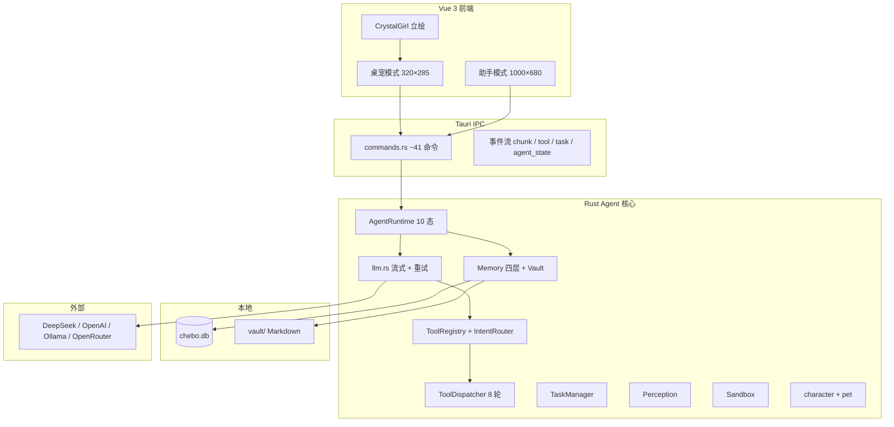

# Chebo AI 桌面宠物 — AI 产品深度分析报告（v2）

> **分析对象**：`erii-ai-desktop-pet`（仓库目录，产品品牌 **Chebo**）  
> **分析视角**：AI 产品 / Agent 架构 / 体验与商业化  
> **技术栈**：Tauri 2 + Vue 3 + Rust 单进程  
> **更新日期**：2026-07-02  
> **产品品牌**：**Chebo**（AI 桌面伴侣角色名与应用名）

---

## 目录

1. [执行摘要](#一执行摘要)
2. [产品定位与差异化](#二产品定位与差异化)
3. [架构总览](#三架构总览)
4. [核心模块深度分析（含优化思路）](#四核心模块深度分析含优化思路)
5. [数据与隐私](#五数据与隐私)
6. [成熟度与缺口总表](#六成熟度与缺口总表)
7. [战略优先级建议](#七战略优先级建议)
8. [指标与风险](#八指标与风险)
9. [结论](#九结论)
10. [附录：模块索引](#附录模块索引)

---

## 一、执行摘要

Chebo 不是「聊天窗口 + 一张立绘」，而是 **人格化 AI 伴侣 + 本地优先桌面 Agent** 的融合体：桌宠养成数值影响 LLM 语气，Agent 工具链提供行动力，四层记忆提供长期关系感。

### 综合评级

| 维度 | 评级 | 说明 |
|------|------|------|
| AI Agent 能力 | ★★★★☆ | 8 轮工具循环、任务规划、L0–L3 权限、语义路由 |
| 记忆与个性化 | ★★★★☆ | 四层记忆 + Vault 双写，缺向量检索 |
| 产品差异化 | ★★★★★ | 桌宠 × Agent × 本地数据 × 双模式 UI |
| 表现层（立绘/语音） | ★★★☆☆ | CrystalGirl PNGTuber 已接入，无 Live2D/TTS |
| 工程成熟度 | ★★★☆☆ | 主链路可用，部分遗留 WS、文档漂移 |
| 商业化就绪 | ★★☆☆☆ | 偏个人工具阶段 |

### 近期进展（相对初版报告）

- 品牌统一为 **Chebo**（数据目录、Tauri identifier、localStorage 迁移）
- 接入 **CrystalGirl PNGTuber**（6 表情 × 待机/说话 + 眨眼）
- **双模式切换**修复（坐标系、窗口 show/unminimize）
- **LLM 503 繁忙**自动重试 + 友好错误提示
- 桌宠 **双击唤出输入** 增加惊讶表情 + 弹跳动画（原仅 resize，无情绪反馈）

### 一句话定位

> **Chebo 把「长期关系」和「可授权行动力」绑在一起——桌宠养成是关系引擎，Agent 是内核，记忆是资产，沙盒是信任。**

---

## 二、产品定位与差异化

### 价值主张

| 层次 | 内容 |
|------|------|
| 情感层 | 常驻透明窗角色，有饥饿/精力/好感，会主动说话 |
| 能力层 | 读文件、搜网、Shell、Git、截图、多步长期任务 |
| 关系层 | 用户画像 + 摘要树 + Vault，跨会话记住你 |
| 控制层 | L0–L3 工具权限、路径白名单、人工确认 |

### 竞品坐标

| 产品 | 陪伴 | 工具 Agent | 本地记忆 | 桌宠形态 |
|------|------|-----------|---------|---------|
| Character.ai / Replika | 强 | 弱 | 云端 | 无 |
| ChatGPT Desktop | 弱 | 中 | 弱 | 无 |
| Obsidian Agent 类 | 弱 | 强 | 强 | 无 |
| **Chebo** | **中强** | **强** | **强** | **有** |

---

## 三、架构总览

### 分层图

### 技术栈

| 层 | 技术 | 说明 |
|----|------|------|
| 壳 | Tauri 2.11 | 透明窗、托盘、全局快捷键 |
| 前端 | Vue 3.5 + Pinia + Tailwind 4 | 双模式、流式聊天气泡 |
| 后端 | Rust + Tokio + sqlx | 单进程 Agent 运行时 |
| LLM | reqwest + OpenAI-compatible | SSE 流式、Vision 回退、503 重试 |
| 数据 | `%APPDATA%\Chebo\` | SQLite + Markdown Vault |

---

## 四、核心模块深度分析（含优化思路）

> 每个模块：**现状 → 关键文件 → 优化思路**。按产品主链路排序。

---

### 4.1 对话与 Agent 主链路

**现状**  
`send_message` 是产品心脏：状态守卫 → Vision 路由 → 富上下文（历史 + 记忆 + 宠物状态）→ 语义工具注入 → 最多 8 轮工具循环 → L2/L3 确认 → 伪流式输出 + 情绪标签。工具格式为 XML 包裹 JSON，兼容弱 function calling 模型。

**关键文件**  
`commands.rs`（`send_message`）、`tool_dispatcher.rs`、`llm.rs`、`tauriService.ts`

**优化思路**

1. **真流式 vs 伪流式**：工具循环结束后当前用 4 字/chunk 模拟打字；工具轮次多时长延迟明显 → 第一轮 LLM 即开 stream，工具轮次用 `assistant_thinking` 展示进度。
2. **可中断对话**：前端增加「停止生成」→ Rust `agent.interrupt()`，避免长时间 Thinking 锁死。
3. **错误恢复 UX**：503 已加重试；补充「一键换模型重试」按钮，减少用户去设置页排查。
4. **对话分支**：支持「重新生成 / 编辑上条消息」，需 SQLite messages 版本字段。
5. **上下文预算器**：按 token 估算裁剪历史 + 记忆注入，避免长会话撑爆窗口。

---

### 4.2 Agent 状态机

**现状**  
10 态：`Idle / Thinking / Talking / Working / Sleeping / Observing / WaitingConfirm / ExecutingTool / Interrupted / ErrorRecover`。前端 `CharacterDisplay` 用光环 + 图标 + CSS 动画区分 thinking/talking/working/sleeping。

**关键文件**  
`agent.rs`、`CharacterDisplay.vue`、`stores/chat.ts`（`agentState`）

**优化思路**

1. **状态与立绘强绑定**：`Working` 时换「专注」表情组；`WaitingConfirm` 时显示问号/警惕表情（需扩展 CrystalGirl 或叠加 UI）。
2. **用户可感知的状态文案**：桌宠模式在气泡旁显示「思考中…」「等你确认…」短标签，减少「卡住」误解。
3. **Sleeping 进入条件可配置**：设置页暴露空闲阈值（当前硬编码在 perception）。
4. **状态机可观测**：开发模式面板实时显示状态转移日志，便于调试并发问题。
5. **Interrupted 产品化**：用户双击或 Esc 触发打断，500ms 后回 Idle 并保留 partial 回复。

---

### 4.3 工具系统与安全沙盒

**现状**  
8 个工具：`read_file`、`list_dir`、`safe_shell`、`git_*`、`web_search`、`memory_recall`、`clipboard_read`、`take_screenshot`。L0–L3 分级；路径白名单 + Shell 黑名单 + 每小时速率限制；审计日志内存 200 条（无 UI）。

**关键文件**  
`tool_registry.rs`、`tool_dispatcher.rs`、`sandbox.rs`、`ToolConfirmDialog.vue`

**优化思路**

1. **补齐 `write_file`（L2）**：文档已承诺写入能力，需与确认弹窗、路径沙盒一并落地。
2. **审计日志 UI**：助手模式设置页增加「最近工具调用」列表，建立信任感。
3. **可插拔搜索**：DuckDuckGo Instant Answer 质量有限 → 支持 Serper/Tavily API Key 配置。
4. **截图 → Vision 闭环**：`take_screenshot` 已有，但结果未自动送入视觉模型 → 截图后自动 attach 或触发 describe。
5. **MCP 适配层**：将 `Tool` trait 映射 MCP Server，形成插件市场基础，避免无限膨胀 `tool_registry.rs`。
6. **工具执行进度流（P3）**：emit `tool_progress`（start/progress/done），前端 AgentTaskPanel 与聊天区共用。

---

### 4.4 语义工具路由（Intent Router）

**现状**  
三级：中文关键词 → 启发式（扩展名/路径/问号）→ Fallback 全量工具。目标减少 60–90% 工具描述 token。

**关键文件**  
`intent_router.rs`

**优化思路**

1. **路由命中率埋点**：记录 Tier1/2/3 分布与误路由案例，指导关键词扩充。
2. **轻量分类器**：本地小模型或 embedding 相似度，替代纯关键词（中英混合场景）。
3. **用户意图显式切换**：聊天框旁「仅聊天 / 允许工具」toggle，覆盖路由结果。
4. **按场景预设**：「写代码」「查资料」「纯陪伴」三套工具子集。
5. **与任务系统联动**：长期任务步骤类型预绑定工具集，减少每步全量 prompt。

---

### 4.5 长期任务系统（Agent Tasks）

**现状**  
独立于单次对话：LLM 规划步骤 → 持久化 `agent_tasks` → 可暂停/续跑/重试 → 崩溃 3s 后恢复 Running 任务。助手模式 `AgentTaskPanel` 展示步骤与 `task_step_thinking` 活动流。

**关键文件**  
`task/task_manager.rs`、`task_planner.rs`、`task_executor.rs`、`AgentTaskPanel.vue`

**优化思路**

1. **任务队列**：支持多任务排队与优先级，而非隐式单任务假设。
2. **步骤模板库**：常见目标（「整理 Downloads」「周报草稿」）预置步骤，减少规划 LLM 调用。
3. **人机协作节点**：某类步骤默认 `Paused` 等用户填参数（如目标文件夹）。
4. **成本可见**：任务卡片显示累计 token / 预估费用（结合 provider_registry 单价）。
5. **桌宠模式轻量入口**：完成/失败时桌宠气泡推送摘要，不必切助手模式才知晓。
6. **组件拆分**：`AgentTaskPanel.vue` 近 900 行 → 拆为 TaskList / TaskDetail / ActivityFeed。

---

### 4.6 记忆系统（Memory + Tree + Vault）

**现状**  
四层：Working（会话窗口）→ Episode（messages）→ Summary（`memory_summaries` + L0–L3 树）→ Core（`user_profile` + `persona_memory`）。confidence ≥ 0.7 写入长期记忆；Vault Markdown 双写，可用 Obsidian 打开；检索为**关键词 + 最近摘要**，无向量。

**关键文件**  
`memory.rs`、`memory_tree.rs`、`vault.rs`、`AssistantLayout.vue`（记忆 Tab）

**优化思路**

1. **向量检索（P0 技术债）**：sqlite-vss / LanceDB / 本地 embedding（bge-small）→ `memory_recall` 工具真正语义化。
2. **记忆可视化**：助手模式展示 L0–L3 树时间线，而不只是扁平列表。
3. **导入/导出包**：一键导出「用户画像 + 摘要 + Vault」zip，换机/备份卖点。
4. **冲突合并 UI**：当 LLM 推断与旧画像冲突时，推送「Chebo 学到了新信息，是否更新？」卡片。
5. **摘要成本控制**：L2/L3 全量 LLM 摘要昂贵 → 增量摘要 + 夜间批处理开关。
6. **隐私档位**：「仅本地 Ollama + 不上传画像字段」极简模式。

---

### 4.7 LLM 与多模型层

**现状**  
OpenAI-compatible 流式/静默调用；主模型 + Vision 回退三路径；`provider_registry` 静态能力表；503/429/502 **自动重试 3 次** + 中文友好错误；设置页可配 API Key / Base URL / 模型名。

**关键文件**  
`llm.rs`、`provider_registry.rs`、`AssistantLayout.vue`（LLM 配置区）

**优化思路**

1. **模型健康检查**：设置页「测试连接」按钮，返回延迟与模型是否可用。
2. **动态模型列表**：支持从 OpenRouter `/models` 拉取，减少硬编码 `deepseek-v4-flash` 等无效模型名。
3. **Reasoning 模型适配**：`deepseek-reasoner` 等思维链模型单独 UI（折叠思考过程）。
4. **本地 Ollama 一键发现**：扫描 `localhost:11434`，降低隐私用户配置门槛。
5. **Token 计量**：会话级 token 统计写入 SQLite，设置页展示「本月用量」。
6. **Fallback 链**：主模型失败自动切备用模型（用户配置优先级列表）。

---

### 4.8 人格、情绪与养成（Pet + Character）

**现状**  
`character.rs`：Chebo 人设 + 数值修饰 prompt + `[EMOTION:xxx]` 解析。`pet.rs`：饥饿/精力/心情/好感/等级/金币；后台 tick 衰减、主动发言、宠物计时任务。前端数值 → 对话风格；CrystalGirl 映射 6 情绪 + 眨眼 + 说话口型。

**关键文件**  
`character.rs`、`pet.rs`、`crystalGirl.ts`、`useCrystalGirlSprite.ts`、`panels/*`

**优化思路**

1. **情绪链路打通**：确保每次 `assistant_done` / `status_comment` 都 `setEmotion`；桌宠 UI 操作（投喂成功）也触发 short `happy` 动画。
2. **双击交互深化**（已做第一步）：打开输入 → `surprised` + 弹跳；可再加随机台词气泡「要聊天吗？」（不调用 LLM，本地文案池）。
3. **养成影响 Agent**：低精力时不仅改 prompt，还可限制工具轮次或建议休息（产品化「别卷了」）。
4. **角色市场**：人设 prompt + 立绘包分离，支持导入社区角色卡。
5. **economy 平衡**：商店/任务金币曲线数据驱动，避免「keep perfect」休闲模式与真实养成脱节。
6. **persona_memory 前端可编辑**：助手模式增加「Chebo 对自己的记忆」浏览，增强角色一致性。

---

### 4.9 桌宠表现层（CrystalGirl / UI）

**现状**  
PNGTuber 资源 15 张 PNG；情绪映射 + 说话/眨眼/中性口型交替；`CharacterDisplay` 状态光环与阴影。无 Live2D/TTS。桌宠模式：气泡 + 悬停按钮列 + 侧滑面板 + 双击唤出 `ChatInput`。

**关键文件**  
`CharacterDisplay.vue`、`useCrystalGirlSprite.ts`、`config/crystalGirl.ts`、`App.vue`

**优化思路**

1. **Live2D / Spine 路线图**：保留 `useCrystalGirlSprite` 抽象，后端接 Live2D 时只换 driver。
2. **点击反馈**：单击角色随机 idle 动作（伸懒腰、歪头）— 本地动画，无需 LLM。
3. **拖拽记忆**：记住桌宠屏幕位置（localStorage），重启恢复。
4. **多皮肤**：`cheboStore.characterImage` 与 CrystalGirl 切换已在 store，可做商店皮肤商品。
5. **TTS 口型同步**：若有语音，Talk 帧与音频 amplitude 绑定。
6. **性能**：大图预加载 + 离屏缓存，避免表情切换闪烁。

---

### 4.10 双模式 UI 与窗口管理

**现状**  
桌宠 320×285（面板 570、聊天 340 高）透明置顶；助手 1000×680 有边框。`useAppMode.ts` 切换装饰/尺寸/位置；托盘可开助手；关闭助手窗口 → 切回桌宠（已修物理坐标 + show）。

**关键文件**  
`useAppMode.ts`、`AssistantLayout.vue`、`App.vue`、`tray.rs`

**优化思路**

1. **首次引导**：首次启动 3 步 onboarding（填 API Key → 认识桌宠 → 试助手模式）。
2. **模式记忆**：上次关闭时是助手还是桌宠，下次启动恢复。
3. **快捷键可配置**：`Ctrl+Shift+Space` 等写入设置页，支持自定义。
4. **助手模式桌宠预览**：侧边栏小头像实时同步主立绘情绪（不只静态 chebo.png）。
5. **多显示器**：切回桌宠时 `clampToWorkArea` 已做；可增加「出现在鼠标所在屏幕」选项。
6. **fade 动画落地**：`fadeIn/fadeOut` 目前 no-op，可用 CSS opacity 或 Tauri 窗口 opacity（若平台支持）。

---

### 4.11 感知与主动智能（Perception + Proactive）

**现状**  
Windows：前台窗口标题 ~5s、剪贴板 ~5s、空闲 → Sleeping。`ProactiveGuard` + 关怀模式控制主动发言频率；饥饿/精力低优先触发。事件经 EventBus，前端感知回调预留。

**关键文件**  
`perception.rs`、`pet.rs`（ai_comment_loop）、`SettingsPanel.vue`（关怀模式）

**优化思路**

1. **macOS / Linux parity**：窗口感知目前 Windows 完整，其他平台 stub → 明确降级提示或接入平台 API。
2. **主动发言质量**：避免纯 LLM 寒暄 → 结合感知（「你在写 Rust 很久了」）模板 + LLM 润色，降 token。
3. **用户可控阈值**：设置页调节「话痨程度」滑块，映射冷却时间。
4. **剪贴板隐私**：默认关闭剪贴板感知，首次开启强提示。
5. **IDE 场景包**：检测 VS Code/Cursor 窗口时，主动 offer「要看当前文件吗？」（需用户确认才读文件）。
6. **与 Agent 联动**：感知到错误日志剪贴板 → 建议「要我帮你分析吗？」

---

### 4.12 前端状态与 IPC 层

**现状**  
`tauriService.ts` 统一 invoke + listen；`chat` / `pet` / `chebo` 三 store。遗留 `websocket.ts` 仍被 `LevelUpToast` 引用；部分 `isConnected` 字段无意义。

**关键文件**  
`tauriService.ts`、`stores/chat.ts`、`stores/pet.ts`、`websocket.ts`（待删）

**优化思路**

1. **删除 WebSocket 遗留**：`LevelUpToast` 改听 `tauriService.onLevelUp`，删除 `websocket.ts`。
2. **事件类型化**：为所有 `listen` payload 建 TypeScript 联合类型，减少 `as unknown`。
3. **离线队列**：发送失败消息本地排队，恢复后重试。
4. **Session 管理**：多会话标签页，SQLite 已有 session_id 可扩展。
5. **乐观 UI 统一**：投喂/购买/任务开始的一致 loading + toast 组件。
6. **E2E 测试**：Playwright + Tauri 驱动关键路径（发消息、切模式、确认工具）。

---

### 4.13 数据库与配置（DB + lib_state）

**现状**  
`chebo.db` 单文件 SQLite：宠物、消息、记忆、任务、商店、配置 KV。`AppConfig` 从环境变量 + DB 加载 LLM 配置。无备份/迁移版本 UI。

**关键文件**  
`db.rs`、`lib_state.rs`、`lib.rs`（setup）

**优化思路**

1. **自动备份**：每日复制 db 到 `backups/`，保留 7 天。
2. **迁移可视化**：schema version 表 + 启动时迁移日志。
3. **配置加密**：API Key 使用 OS keychain（windows-credentials / keyring crate）而非明文 KV。
4. **数据统计面板**：消息数、记忆条数、任务完成率，服务产品迭代。
5. **导出 GDPR 包**：用户一键导出全部个人数据 JSON。

---

### 4.14 托盘与系统集成

**现状**  
托盘菜单：显示/隐藏、助手模式、重置、关于、退出。左键切换显示；桌宠模式关闭 → hide；助手关闭 → 切桌宠。全局快捷键多候选注册。

**关键文件**  
`tray.rs`、`lib.rs`（shortcut plugin）

**优化思路**

1. **托盘迷你状态**：图标 tooltip 显示饥饿/心情或「思考中」。
2. **重置粒度**：「重置数值」与「清空记忆」分离，避免误操作。
3. **开机自启**：可选设置项（注册表 / LaunchAgent）。
4. **通知中心**：Windows Toast 推送任务完成（用户可选）。
5. **快捷发送**：托盘菜单「粘贴板提问」一键发 LLM。

---

## 五、数据与隐私

| 数据 | 本地 | 发往 LLM |
|------|------|---------|
| 完整聊天记录 | ✓ SQLite | 最近 N 条 |
| 用户画像 / 摘要 | ✓ | 注入 system prompt |
| 工具读取的文件 | 本地读 | 作为上下文上传 |
| API Key | ✓ 本地 | 不经过第三方中转 |

**产品建议**：设置页明确「本地存储 ≠ 云端不可见」；突出 Ollama 全本地档位；记忆 Tab 支持单条删除与导出。

---

## 六、成熟度与缺口总表

| 模块 | 成熟度 | 主要缺口 |
|------|--------|---------|
| 对话 Agent 主链路 | 高 | 不可中断、伪流式 |
| 工具 + 沙盒 | 高 | write_file、审计 UI、MCP |
| 长期任务 | 中高 | 多任务队列、桌宠侧通知 |
| 记忆 | 中高 | 向量检索、树可视化 |
| LLM 层 | 中 | 动态模型列表、用量统计 |
| 人格养成 | 中 | 情绪与 UI 操作未全打通 |
| 桌宠表现 | 中 | Live2D/TTS、单击互动 |
| 双模式 UI | 中高 | onboarding、模式记忆 |
| 感知 | 中 | 非 Windows、隐私控件 |
| 前端 IPC | 中 | WS 遗留、类型化 |
| 托盘 | 中 | 自启、通知 |

---

## 七、战略优先级建议

### 短期（0–3 个月）

| 优先级 | 事项 | 关联模块 |
|--------|------|---------|
| P0 | 删除 WS 遗留、统一事件监听 | 4.12 |
| P0 | 向量记忆检索 MVP | 4.6 |
| P1 | 对话可中断 + 真流式优化 | 4.1 |
| P1 | 截图 Vision 闭环 | 4.3 |
| P1 | 模型连接测试 + 有效模型名修正 | 4.7 |
| P2 | Live2D 或更丰富 PNG 动作 | 4.9 |
| P2 | 审计日志 / 工具进度 UI | 4.3 |

### 中期（3–6 个月）

- MCP 插件协议
- 角色/皮肤市场
- macOS 感知 parity
- 记忆导出与换机
- Token 成本看板

### 长期

> **「本地优先、人格化、可授权的桌面 Agent OS」** — 桌宠是 shell，Agent 是内核。

---

## 八、指标与风险

### 建议 KPI

| 类型 | 指标 |
|------|------|
| 激活 | 首日完成 API 配置并发送 3 条消息 |
| 陪伴 | 主动发言回应率 |
| Agent | 工具成功率、L2/L3 确认通过率 |
| 记忆 | 7 日回访「它记得我」主观调研 |
| 成本 | 人均日 token、intent router Tier1 命中率 |
| 留存 | 助手周活 / 桌宠周活比 |

### 风险矩阵

| 风险 | 严重性 | 缓解 |
|------|--------|------|
| 用户以为全本地 AI | 高 | 隐私分级 UI + Ollama 引导 |
| Agent 误执行高危命令 | 高 | 保持 L3 确认、保守白名单 |
| 陪伴 vs 效率心智冲突 | 中 | 双模式分离 + 场景文案 |
| 云端 503/限流 | 中 | 已加重试；备用模型链 |
| 无 Live2D 外观落后 | 中 | 差异化在 Agent+记忆 |
| Rust 贡献门槛 | 中 | MCP 外包扩展、文档化 Tool trait |

---

## 九、结论

Chebo 的 **Agent 内核与记忆架构** 已明显超出原始 MVP 文档阶段；当前瓶颈主要在 **表现层（Live2D/语音）**、**记忆语义检索**、**前端遗留清理** 与 **部分能力闭环（截图 Vision、write_file）**。

若按本报告第四节各模块优化思路分批推进，产品可在 3 个月内从「可演示的开发者玩具」升级为「可日常驻留的 AI 伴侣 + 轻量 Copilot」。

---

## 附录：模块索引

### Rust（`frontend/src-tauri/src/`）

| 文件 | 职责 |
|------|------|
| `lib.rs` | 应用入口、后台任务 |
| `commands.rs` | Tauri IPC 命令 |
| `agent.rs` | 10 态状态机 |
| `llm.rs` | LLM 调用 + 重试 |
| `character.rs` | 人设 + 情绪 |
| `pet.rs` | 养成循环 + 主动发言 |
| `memory.rs` / `memory_tree.rs` / `vault.rs` | 记忆体系 |
| `intent_router.rs` | 语义工具路由 |
| `tool_registry.rs` / `tool_dispatcher.rs` / `sandbox.rs` | 工具与安全 |
| `perception.rs` | 环境感知 |
| `provider_registry.rs` | 模型能力表 |
| `task/*` | 长期任务 |
| `tray.rs` | 系统托盘 |
| `db.rs` | SQLite |

### Vue（`frontend/src/`）

| 文件 | 职责 |
|------|------|
| `App.vue` | 桌宠根布局 |
| `AssistantLayout.vue` | 助手模式 |
| `composables/useAppMode.ts` | 双模式切换 |
| `composables/useCrystalGirlSprite.ts` | 立绘驱动 |
| `config/crystalGirl.ts` | 情绪资源映射 |
| `services/tauriService.ts` | IPC 门面 |
| `stores/chat.ts` / `pet.ts` / `chebo.ts` | 状态 |
| `components/CharacterDisplay.vue` | 角色展示 |
| `components/AgentTaskPanel.vue` | 长期任务 UI |

---

*报告基于代码静态分析 + 模块探索交叉验证。架构或功能变更时请同步更新本节与第四节对应模块。*
