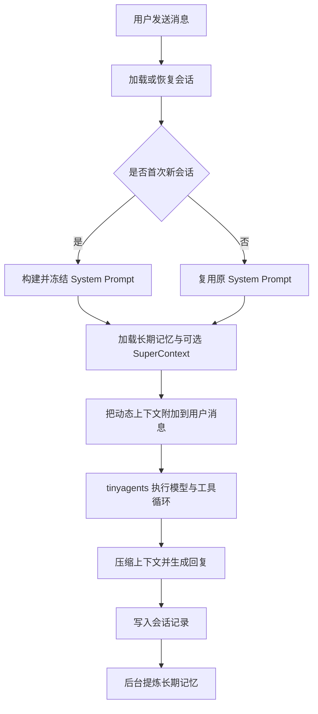
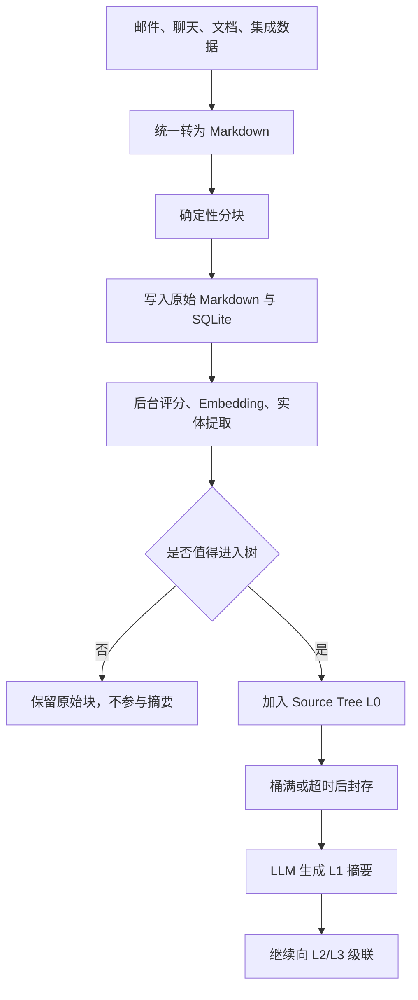

老大，我把 OpenHuman 当前 `main` 分支的实现链路梳理了一遍。它真正有价值的地方，不是简单做了一个“带向量数据库的聊天机器人”，而是把：

* 当前会话上下文
* 跨会话原始记录
* 提炼后的长期记忆
* 外部数据知识库
* Agent 运行检查点

拆成了几套不同的存储和召回机制。

一句话概括：

> OpenHuman 的记忆策略是“原始记录负责可追溯，结构化记忆负责快速召回，Memory Tree 负责长期压缩，Agent Checkpoint 负责运行恢复”。

以下基于当前仓库快照分析；项目正在将 Agent 引擎迁移到 `tinyagents`、将记忆引擎迁移到 `tinycortex`，因此部分旧模块已变成适配层。

## 一、项目整体架构

主要技术栈：

| 层级           | 实现                                           |
| ------------ | -------------------------------------------- |
| 桌面端 UI       | React 19 + TypeScript + Redux Toolkit + Vite |
| 桌面壳          | Tauri 2                                      |
| 核心服务         | Rust + Tokio                                 |
| UI 与 Core 通信 | HTTP JSON-RPC，经 Tauri Relay 转发               |
| Agent 引擎     | `tinyagents` 1.7                             |
| Memory 引擎    | `tinycortex`                                 |
| 本地存储         | SQLite、JSONL、Markdown                        |
| 工具系统         | MCP + Rust 原生工具 + Node/Python Runtime        |
| Agent 工作流    | 可检查点状态图、并行子 Agent、人工审批                       |
| 模型接入         | OpenHuman 自己的 Provider/ModelRouter           |

React 主要负责界面与状态展示，真正的会话、记忆、工具调用、加密、调度和持久化都在 Rust Core 中完成。

详细架构可参考：[architecture.md](https://github.com/tinyhumansai/openhuman/blob/main/gitbooks/developing/architecture.md)

---

# 二、最重要的理解：它有五层“记忆”

OpenHuman 中容易混淆的地方，是它把很多东西都叫 Memory。实际上可以拆成五层。

| 层级               | 保存什么           | 主要用途      |
| ---------------- | -------------- | --------- |
| 会话工作上下文          | 本轮发送给模型的消息     | 保持当前对话连续  |
| 原始会话记录           | 用户、助手、工具消息     | 展示、恢复、审计  |
| 跨会话记忆            | 偏好、决策、承诺、未完成任务 | 新对话中恢复连续性 |
| Memory Tree      | 邮件、文档、聊天等压缩知识  | 长期知识检索    |
| Agent Checkpoint | 图状态、子任务状态、事件日志 | 中断后继续执行   |

因此：

* “还记得刚才说了什么”主要依赖当前会话历史。
* “还记得上周另一个对话说了什么”依赖跨线程搜索和提炼记忆。
* “还记得邮箱、Notion、GitHub 里的内容”依赖 Memory Tree。
* “重启后继续之前的 Agent 任务”依赖 Checkpoint，而不是聊天记忆。

---

# 三、会话策略：一次消息到底怎么处理

整体流程大致如下：



## 3.1 System Prompt 只生成一次

这是它会话策略中很讲究的一点。

第一次对话时，系统会把下面这些内容放进 System Prompt：

* Agent 身份和行为规范
* 工具说明
* 已连接的集成
* 用户显式偏好
* 学习出的观察和模式
* Memory Tree 根节点摘要
* `PROFILE.md`
* `MEMORY.md`

之后同一个会话不会重新生成 System Prompt，即使集成、工具或者记忆发生变化，也尽量保持原始前缀不变。

原因是维持模型的 KV Cache 命中。只要 System Prompt 前缀发生变化，模型就可能重新执行整段 prefill。

动态变化的内容则放进每一轮的用户消息前面，例如：

```text
[User working memory]
...

[Prior conversations]
...

[Cross-chat context — historical; capabilities may have changed since]
...

[active_goal]
...
```

这是一种很实用的设计：

> 稳定内容放 System Prompt，动态内容放 User Message。

相关实现：[session/turn/context.rs](https://github.com/tinyhumansai/openhuman/blob/main/src/openhuman/agent/harness/session/turn/context.rs)、[session/turn/core.rs](https://github.com/tinyhumansai/openhuman/blob/main/src/openhuman/agent/harness/session/turn/core.rs)

## 3.2 会话恢复不是简单加载聊天文本

Agent 会话使用单独的 JSONL 保存模型实际看到的消息：

```text
workspace/
├─ session_raw/
│  └─ 1770000000_orchestrator_thread-xxx.jsonl
└─ sessions/
   └─ YYYY_MM_DD/
      └─ 1770000000_orchestrator_thread-xxx.md
```

其中：

* `session_raw/*.jsonl` 是权威数据。
* `sessions/*.md` 只是给人查看的渲染结果。
* JSONL 保存精确的 system/user/assistant/tool 消息。
* 还会记录模型、Provider、Token、成本、推理内容和工具调用。

恢复时加载的是精确的 Provider Message，而不是把 Markdown 再解析回来，因此能最大程度保持模型缓存前缀一致。

相关实现：[transcript.rs](https://github.com/tinyhumansai/openhuman/blob/main/src/openhuman/agent/harness/session/transcript.rs)

## 3.3 恢复时会修复不完整的工具调用链

如果截断位置刚好落在：

```text
assistant tool_call
tool result
```

中间，直接把后半部分传给模型会产生非法消息序列。

所以 OpenHuman 会：

* 删除开头没有对应 `tool_call` 的孤立 Tool Result。
* 删除结尾没有 Tool Result 的 Assistant Tool Call。
* 始终保留 System Message。
* 超过 `max_history_messages` 时优先保留最近消息。

这属于很细但很重要的工程处理，否则长会话恢复后容易出现 Provider 400 错误。

---

# 四、原始对话如何保存

UI 展示的 Conversation 和模型恢复用的 Session Transcript 目前还是两套存储。

Conversation Store 采用：

```text
workspace/
└─ memory/conversations/
   ├─ threads.jsonl
   └─ threads/
      ├─ thread-a.jsonl
      └─ thread-b.jsonl
```

特点包括：

* 线程元信息采用 append-only JSONL。
* 每个线程有单独的消息 JSONL。
* 消息 ID 用于幂等去重。
* 支持更新标题、标签和消息。
* 有倒排索引，用于跨线程关键词搜索。
* 当前线程会从跨会话搜索结果中排除。

外部渠道的线程 ID 也有策略：

* Slack 等渠道可以把 `thread_ts` 纳入线程 ID。
* Telegram 的 `thread_ts` 不拆分会话。
* 重复事件不会重复写入消息。
* 写入前检查 workspace，防止用户切换工作区时旧异步任务写错位置。

相关实现：[memory_conversations/mod.rs](https://github.com/tinyhumansai/openhuman/blob/main/src/openhuman/memory_conversations/mod.rs)、[memory_conversations/bus.rs](https://github.com/tinyhumansai/openhuman/blob/main/src/openhuman/memory_conversations/bus.rs)

---

# 五、每一轮会召回哪些记忆

它并不是单纯执行一次 `vectorSearch(userMessage)`。

当前的上下文注入可以分成几条通道。

## 5.1 Working Memory

主要保存当前用户相对稳定但可能变化的信息，例如：

* 当前项目
* 时区
* 近期工作状态
* 临时偏好
* 正在推进的事项

只允许 `working.user.*` 这类 Key 自动进入上下文，避免任意聊天内容污染工作记忆。

默认上下文总预算约为 2000 字符，相关性门槛默认是 `0.4`。

## 5.2 Prior Conversations

完成的会话会在后台提取：

* 偏好
* 决策
* 承诺
* 未解决事项
* 更高层次的反思

但自动注入新会话时，只取高重要性的 `high.*` 记忆，最多三条。

较低重要性的内容仍然可以通过 Memory Tool 查询，但不会默认塞进每次聊天。

## 5.3 Cross-chat Context

这是一条很实用的“快速通道”。

系统会直接扫描其他线程的消息 JSONL，通过倒排索引进行跨线程检索：

* 排除当前线程。
* 最多保留少量结果。
* 每条结果截断成短片段。
* 明确标记为“历史信息，能力可能已变化”。

它不需要等待后台记忆提炼完成，所以另一个会话里刚聊完的内容，很快就能在新会话中搜到。

相关实现：[memory_loader.rs](https://github.com/tinyhumansai/openhuman/blob/main/src/openhuman/agent_memory/memory_loader.rs)

## 5.4 Preferences 分为两条 Lane

OpenHuman 对偏好的处理比较谨慎：

* General Preference：用户明确保存的长期偏好，写进首次 System Prompt。
* Situational Preference：与当前问题语义相关的偏好，每轮动态召回。

它不会直接把系统推测出的用户偏好当作永久事实。推测出的偏好应该先询问用户，确认后才写入显式偏好存储。

这是一个很合理的产品策略，可以减少“AI 自己脑补用户喜好”。

## 5.5 当前用户消息异步保存

用户每发送一条消息，系统会：

1. 生成唯一的 `user_msg:{uuid}`。
2. 以 `Conversation` 类型异步保存。
3. 标记当前 `thread_id`。
4. 不阻塞当前回答。
5. 当前线程召回时排除同一个 `thread_id`。

之所以使用 UUID，是因为旧实现使用固定 `user_msg` Key，会不断覆盖前一条消息。

---

# 六、长期记忆：Memory Tree 怎么实现

## 6.1 数据进入流程



主要特点：

* 输入先统一规范化为 Markdown。
* Chunk ID 是确定性的，相同内容重复导入不会产生重复块。
* 热路径不执行昂贵 LLM 请求。
* Embedding、实体提取、深度评分和树摘要由后台 Worker 完成。
* SQLite 记录 Chunk、Score、Entity、Tree、Job、Hotness。
* Markdown 文件保留可查看的原始内容和来源信息。

入口实现：[ingest_pipeline.rs](https://github.com/tinyhumansai/openhuman/blob/main/src/openhuman/memory/ingest_pipeline.rs)

## 6.2 树不是目录树，而是“分层摘要树”

假设持续导入某个 Slack Channel：

```text
L0：原始 Chunk
L1：一批 Chunk 的摘要
L2：一批 L1 摘要的摘要
L3：更长期、更压缩的摘要
```

写入 L0 后，如果桶满了：

1. 封存当前桶。
2. 调用摘要模型生成 L1 节点。
3. 把 L1 节点加入上一层的桶。
4. 如果上一层也满了，继续向上级联。
5. 长时间没满的桶通过 TTL Flush 强制封存。

这样做的好处是：

* 最近的内容可以查看原始块。
* 长期内容可以先看高层摘要。
* 需要证据时再逐层 Drill Down。
* 不需要把几万条向量结果直接塞给模型。

相关实现：[memory-tree architecture](https://github.com/tinyhumansai/openhuman/blob/main/gitbooks/developing/architecture/memory-tree.md)、[bucket_seal.rs](https://github.com/tinyhumansai/openhuman/blob/main/src/openhuman/memory_tree/tree/bucket_seal.rs)

## 6.3 当前实际主要是 Source Tree

这里存在明显的文档漂移。

旧文档仍然描述三棵树：

* Source Tree
* Topic Tree
* Global Tree

但当前架构代码已经明确说明：

* Global Tree 已移除。
* Topic Tree 已移除。
* 当前主要保留 Source Tree + Entity Index。
* `query_topic`、`query_global` 已从工具模式中删除。

原因是 Topic 和 Global 本身也是 Source Tree 的派生投影，维护成本和数据重复较高。

当前工具实际提供：

* `search_entities`
* `query_source`
* `drill_down`
* `cover_window`
* `fetch_leaves`
* `walk`
* `smart_walk`
* `ingest_document`

相关实现：[memory/query/mod.rs](https://github.com/tinyhumansai/openhuman/blob/main/src/openhuman/memory/query/mod.rs)

## 6.4 检索不是只靠向量

当前检索前会先抽取 Query Entity，然后结合：

* Entity Index
* Embedding 相似度
* Source Scope
* 时间范围
* Tree Summary
* Hotness
* 最大图跳数
* 原始叶子节点

例如用户问：

> “上个月 Alice 对 VoltageEMS 的部署方案有什么意见？”

可能的流程是：

1. 识别 `Alice`、`VoltageEMS`。
2. 查询 Entity Index。
3. 找到相关 Source Tree。
4. 在摘要节点中定位高相关部分。
5. Drill Down 到更细粒度摘要。
6. 最后 Fetch Leaves 获取原始内容作为证据。

快速检索适配层见：[retrieval/fast.rs](https://github.com/tinyhumansai/openhuman/blob/main/src/openhuman/memory_tree/retrieval/fast.rs)

不过现在大量核心排序逻辑已经下沉到 `tinycortex`，OpenHuman 仓库中的很多文件只是配置和类型适配器。因此 README 中的“70% 向量 + 30% FTS”等固定公式，不宜直接当作当前实现的唯一事实。

---

# 七、会话结束后如何形成长期记忆

完成的 `session_raw/*.jsonl` 会进入 Transcript Ingest Pipeline：

```text
SessionTranscript
    → 启发式提取
    → 去重
    → 持久化
    → Conversational Memory / Reflections
```

目前主要是启发式提取，不强制依赖 LLM。

它会尝试识别：

* 用户偏好
* 已做决定
* 对未来的承诺
* 未完成任务
* 反复出现的主题
* 对 Agent 行为的反馈

每条记忆包含 Provenance：

* `thread_id`
* Transcript 文件名
* 原始消息位置
* 提取时间

写入阶段最大并发数为 8，避免一段长会话产生几十个 Embedding 请求同时冲击 Provider。

相关实现：[transcript_ingest/mod.rs](https://github.com/tinyhumansai/openhuman/blob/main/src/openhuman/learning/transcript_ingest/mod.rs)

这套策略的优点是便宜、稳定、离线可运行；缺点是启发式提取质量有限，隐含决定或复杂偏好可能识别不到。

---

# 八、SuperContext 的真实策略

SuperContext 不是普通 Memory Search Tool，而是 Harness 强制执行的“首次对话预检”。

流程是：

1. 新线程第一轮。
2. 启动只读 `context_scout` 子 Agent。
3. 搜索 Memory Tree、工作区文件和集成数据。
4. 返回：

```text
[context_bundle]
...
[/context_bundle]
```

5. 只提取标签内的内容。
6. 放到用户消息前面。
7. 再交给 Orchestrator 回答。

如果标签：

* 缺失
* 重复
* 顺序错误
* 未闭合
* 内容为空

则完全放弃这次注入，正常冷启动，不把异常结果塞给主模型。

不过它不是所有首次会话都会执行。源码还有以下门禁：

* 必须是用户可见的 `orchestrator`。
* 必须是第一轮。
* 恢复的旧会话不执行。
* 简单的“Hi”“Thanks”等问候不执行。
* 简单本地文件操作一般不执行。
* 对不支持原生 Tool Calling 的本地小模型，除非明确提到历史或集成，否则不执行。

相关实现：[super-context.md](https://github.com/tinyhumansai/openhuman/blob/main/gitbooks/features/super-context.md)、[turn/core.rs](https://github.com/tinyhumansai/openhuman/blob/main/src/openhuman/agent/harness/session/turn/core.rs)

值得注意的是：

> 功能文档写着 SuperContext 默认开启，但当前源码 `ContextConfig::default()` 将它设置为 `false`。

因此当前源码事实应以“默认关闭、用户选择开启”为准：[config/schema/context.rs](https://github.com/tinyhumansai/openhuman/blob/main/src/openhuman/config/schema/context.rs)

---

# 九、长会话如何控制 Token

OpenHuman 的上下文压缩不是只有“超过长度就总结”，而是分阶段处理。

大致顺序：

1. 工具尽量返回 Markdown，减少 JSON Token。
2. TokenJuice 对大型结构化工具输出进行内容感知压缩。
3. 单个工具结果超过阈值时，可调用 Summarizer。
4. 对每个工具结果施加硬字节上限。
5. Microcompact 清空较老的工具结果正文，保留调用结构。
6. 接近上下文窗口时执行 LLM Autocompact。
7. 最后用 Message Trim 做确定性硬裁剪。

当前配置中：

* 单个工具结果默认约 16 KiB 上限。
* 超过约 4000 Token 的工具结果可触发 Summarizer。
* 过大的结果不会浪费模型调用，会直接走截断。
* 最近若干条 Tool Result 保留原文。
* System Message 永远保留。
* 截断不会破坏 Tool Call/Tool Result 配对。

相关实现：[context/manager.rs](https://github.com/tinyhumansai/openhuman/blob/main/src/openhuman/context/manager.rs)、[tinyagents/middleware.rs](https://github.com/tinyhumansai/openhuman/blob/main/src/openhuman/tinyagents/middleware.rs)

---

# 十、Agent 会话与运行恢复

聊天历史恢复和 Agent 执行恢复不是一回事。

OpenHuman 的 Agent Turn 运行在 `tinyagents` Harness 上：

* 每个 Turn 可以多次调用模型和工具。
* 支持子 Agent。
* 支持并行 Map-Reduce。
* 支持人工审批和澄清。
* 支持中途 Steering。
* 支持最大调用次数和无进展熔断。
* 图运行状态通过 SQLite Checkpoint 保存。

另外还有持久化 Event Journal：

```text
workspace/tinyagents_store/journal/*.jsonl
```

每个事件有稳定 ID：

```text
{run_id}-evt-{offset}
```

所以 UI 后连接也可以重新播放运行过程。

子 Agent 如果需要用户补充信息，会保存：

* 当前历史
* 问题
* 可选项
* 配置覆盖
* Task ID

等待用户回答后继续，而不是重新开始整个任务。

相关实现：[agent-harness.md](https://github.com/tinyhumansai/openhuman/blob/main/gitbooks/developing/architecture/agent-harness.md)

---

# 十一、我对这套设计的评价

## 做得比较好的地方

1. 原始记录与长期记忆分离

原始会话不会因为摘要而消失，长期记忆也不需要每次加载完整历史。

2. KV Cache 意识很强

System Prompt 冻结、动态上下文放 User Message，这属于很成熟的会话成本优化。

3. 跨会话连续性有快慢两条路线

* 快：直接搜索其他线程 JSONL。
* 慢：后台提炼重要事实和反思。

即使长期记忆处理尚未完成，新会话也不至于完全失忆。

4. Memory Tree 比纯向量检索更适合长时间跨度数据

树可以先提供高层摘要，再逐层获取证据，比较适合邮箱、文档、项目历史等长期数据。

5. Provenance 做得认真

很多记忆都保留来源线程、文件、时间和原消息位置，不只是生成一段无法验证的“AI 记忆”。

## 当前问题

1. 存储体系偏复杂

现在至少同时存在：

* Conversation JSONL
* Session Transcript JSONL
* Markdown Transcript
* SQLite Memory
* Markdown Vault
* Memory Tree
* TinyAgents Journal
* Graph Checkpoint

这带来同步、迁移和一致性成本。

2. 代码正处于迁移期

大量模块已经变成：

```rust
tinycortex::xxx(...)
```

形式的薄适配器。旧实现、迁移 Shim、新 Crate 同时存在，阅读成本较高。

3. 文档漂移明显

例如：

* SuperContext 文档说默认开，源码默认关。
* 旧 Memory Tree 文档仍描述 Topic/Global Tree。
* 当前代码已经删除相关查询模式。
* Chunk 大小在不同文档中也出现不同描述。

4. 长期记忆提取仍然偏启发式

优点是稳定、便宜；缺点是对复杂语义、隐含偏好、条件性决策识别有限。

5. “本地存储”不等于“数据绝不离开本机”

记忆文件确实存本地，但如果使用云端模型进行摘要、Embedding 或回答，选中的相关内容仍可能发送给模型 Provider。只有 Privacy Mode + 本地模型才能更接近真正全离线。

---

# 十二、最值得借鉴的部分

如果我们自己开发长期记忆 Agent，我认为最值得借鉴的是下面这套简化结构：

```text
当前线程
├─ 原始消息 JSONL
├─ 最近消息窗口
└─ 动态上下文

跨线程
├─ 原始消息全文检索
└─ 当前线程排除

长期记忆
├─ 显式用户偏好
├─ 高重要性事实
├─ 决策与未完成事项
└─ 来源与时间

外部知识
├─ 统一 Markdown
├─ 确定性 Chunk
├─ Entity Index
├─ Embedding
└─ 分层摘要树

Agent 运行
├─ Event Journal
├─ Graph Checkpoint
└─ Human-in-the-loop Resume
```

我的总体判断是：

> OpenHuman 的记忆设计方向非常优秀，特别是“原始会话 + 提炼记忆 + 分层知识树 + 检查点”的分层思想；但当前仓库处于快速重构期，架构先进程度高于代码成熟度，文档与实现也还没有完全收敛。
